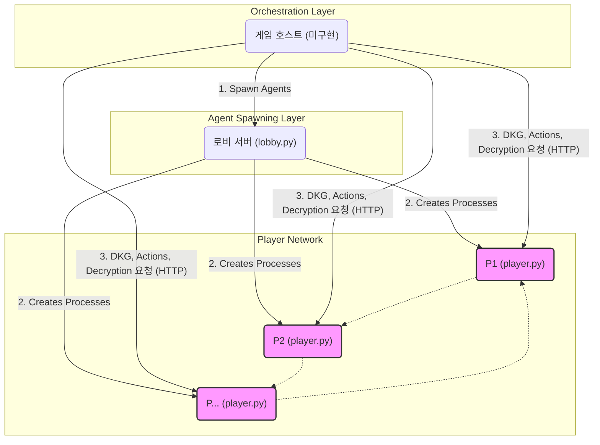

# 소프트웨어 설계 문서 (Software Design Document) - v2.0

## 1. 개요 (Overview)

이 문서는 Python 기반의 AI 마피아 게임 프로젝트의 설계와 아키텍처를 상세히 설명합니다. 본 프로젝트의 핵심 목표는 **동형암호(Homomorphic Encryption)** 기술을 활용하여, 신뢰할 수 있는 중앙 서버(Trusted Third Party) 없이도 게임의 핵심 로직(역할 배정, 투표, 직업 능력 등)을 플레이어 간의 P2P(Peer-to-Peer) 상호작용만으로 안전하게 처리하는 **Trustless 마피아 게임**을 구현하는 것입니다.

각 플레이어는 독립적인 `FastAPI` 서버로 동작하는 AI 에이전트이며, 게임의 전체 흐름은 이 에이전트들의 API를 조율하는 **게임 호스트(Game Host)** 에 의해 관리됩니다.

이 문서는 프로젝트의 현재 아키텍처, 구현된 기능과 미구현된 기능의 명확한 구분, 그리고 신규 개발자의 온보딩을 돕기 위한 구체적인 개발 로드맵을 제공하는 것을 목적으로 합니다.

---

## 2. 시스템 아키텍처 (System Architecture)

본 시스템은 크게 3가지 주요 컴포넌트로 구성됩니다.

| 컴포넌트 | 핵심 파일 | 역할 및 책임 | 현재 상태 |
| :--- | :--- | :--- | :--- |
| **1. 게임 호스트 (Game Host)** | *(미구현)* | - 게임 세션(시작, 종료) 및 규칙(낮/밤 진행, 승패 판정) 관리<br>- 플레이어 에이전트들의 API를 호출하여 게임 로직 조율<br>- DKG, 투표, 공동 복호화 등 암호 프로토콜의 코디네이터 역할<br>- (선택) 인간 플레이어를 위한 UI/CLI 제공 | **미구현 (구현 최우선 순위)** |
| **2. 플레이어 에이전트 (Player Agent)** | `player.py` | - 개별 플레이어의 상태(`AgentState`) 관리<br>- `FastAPI` 기반 API 서버<br>- 동형암호 프로토콜 참여(키 생성, 암호화, 부분 복호화)<br>- `agent_logic.py`를 통해 역할과 상황에 맞는 행동 결정 | **핵심 기능 구현됨** |
| **3. 로비 서버 (Lobby Server)** | `lobby.py` | - `player.py` 프로세스를 지정된 수만큼 생성 및 관리 | **구현됨** |

### 2.1. 아키텍처 다이어그램



### 2.2. 가장 시급한 문제: 게임 호스트의 부재

현재 코드베이스에서 가장 치명적이고 시급한 문제는 **게임 호스트(Game Host)가 존재하지 않는다**는 점입니다. 개별 AI 에이전트들은 기능적으로 잘 구현되어 있으나, 이들을 조율하여 실제 게임을 진행시킬 지휘자가 없습니다. 따라서 **이 프로젝트의 최우선 개발 과제는 게임 호스트를 구현하는 것**입니다.

---

## 3. 핵심 설계: 동형암호와 Trustless 모델

프로젝트의 핵심은 `openfhe-python` 라이브러리를 사용한 동형암호 기반의 Trustless 모델입니다. 이를 통해 어떤 플레이어도, 심지어 게임 호스트조차도 다른 플레이어의 역할이나 개인 행동을 알 수 없습니다.

### 3.1. 기술 스택

- **웹 프레임워크:** `FastAPI` (로비, 플레이어 에이전트)
- **동형암호 라이브러리:** `openfhe-python` (BFVrns 스킴 사용)
- **AI 에이전트:** `openai` (GPT-4o-mini 모델)

### 3.2. 분산 키 생성(DKG) 및 임계값 복호화

- **프로토콜:**
    1. **Setup (`/dkg_setup`):** 호스트가 암호화 컨텍스트(`CryptoContext`)를 생성하여 모든 플레이어에게 배포합니다.
    2. **Key Generation (`/dkg_round`):** 플레이어들은 호스트의 조율 하에 체인 형태로 각자의 키 쌍 일부를 생성하고 이전 플레이어의 공개키와 결합합니다. 마지막 플레이어까지 완료되면, 전체 플레이어의 비밀키 조각들 없이는 해독이 불가능한 공동 공개키(`joint_public_key`)가 생성됩니다.
    3. **Partial Decryption (`/partial_decrypt`):** 암호화된 결과(예: 투표 결과)를 복호화할 때, 모든 플레이어는 자신의 비밀키 조각으로 부분 복호화를 수행합니다.
    4. **Fusion Decryption:** 호스트는 모든 부분 복호화 결과를 취합하여 최종 평문 결과를 얻습니다. 이 과정에서 어떤 단일 개체도 전체 비밀키를 알지 못합니다.

### 3.3. 블라인드 역할 할당 (Blind Role Assignment)

- **목표:** 호스트조차 각 플레이어의 역할을 알 수 없도록 역할을 배정합니다.
- **프로토콜 (`/blind_role_assignment`, `/complete_role_decryption`):**
    1. 호스트는 역할 벡터 `[역할1, 역할2, ...]`를 암호화하여 모든 플레이어에게 보냅니다.
    2. 각 플레이어는 자신에게 해당하는 인덱스의 암호화된 역할(`my_encrypted_role`)만을 취합니다.
    3. 호스트의 조율 하에, 모든 플레이어들은 특정 플레이어의 암호화된 역할에 대한 부분 복호화를 수행하고, 그 결과를 해당 플레이어에게 직접 전달합니다. (현재는 호스트가 중계)
    4. 결과를 수신한 플레이어는 자신의 부분 복호화 결과를 마지막으로 추가하여 최종적으로 자신의 역할을 복호화합니다.
- **`[TODO]` 개선 과제:** 현재 부분 복호화 결과를 호스트가 중계하는 방식(`player.py`의 TODO 주석)은 중앙화되어 있습니다. 향후 플레이어 간 직접 통신(P2P)을 통해 이 과정을 처리하도록 개선하여 완전한 Trustless 모델을 구축해야 합니다.

### 3.4. 블라인드 액션 프로토콜 (Blind Action Protocol)

- **목표:** 밤 단계에서 플레이어가 자신의 역할을 노출하지 않고 직업 능력을 사용하게 합니다.
- **프로토콜 (`/request_action`):**
    1. 밤이 되면, 모든 플레이어는 자신의 역할과 무관하게 **3개의 암호화된 벡터**(`attack_vector`, `heal_vector`, `investigate_vector`)를 생성하여 호스트에게 제출합니다.
    2. **자신의 역할에 해당하는 벡터에만 실제 행동**을 담고, 나머지 두 벡터는 암호화된 영벡터(`Enc([0,0,...])`)로 채웁니다.
        - **마피아:** `attack_vector`에 실제 타겟을, 나머지는 영벡터로 제출.
        - **의사:** `heal_vector`에 실제 타겟을, 나머지는 영벡터로 제출.
        - **경찰/시민:** 모든 벡터를 영벡터로 제출 (경찰의 조사는 별도 프로토콜).
    3. 호스트는 모든 플레이어로부터 제출된 `attack_vector`들을 동형암호로 합산하고, `heal_vector`들을 합산합니다. 영벡터는 결과에 영향을 주지 않으므로, 최종적으로 마피아의 공격 대상과 의사의 치유 대상을 역할 노출 없이 알아낼 수 있습니다.

---

## 4. AI 에이전트 설계 (AI Agent Design)

### 4.1. 프롬프트 및 도구 기반 아키텍처

- **설계:** `agent_logic.py`는 AI 에이전트의 두뇌 역할을 합니다.
- **동적 도구 생성 (`create_agent_tools`):** 게임의 국면(`phase`)과 에이전트의 역할(`role`)에 따라 AI가 사용할 수 있는 함수(tool) 세트를 동적으로 생성하여 제공합니다. 예를 들어, 토론 시간에는 전략 분석 도구를, 투표 시간에는 투표 실행 도구만을 제공하여 AI의 행동을 효과적으로 유도합니다.
- **동적 프롬프트 생성 (`create_action_prompt`, `create_chat_prompt`):** 매 턴마다 현재 게임 상황(생존자, 남은 시간 등)을 반영한 상세한 지침을 담은 프롬프트를 생성하여 AI의 의사결정을 돕습니다.

### 4.2. 의심 및 신념 관리

- **구현:** `suspicion.py`는 AI가 다른 플레이어에 대한 신념을 관리하는 구조화된 방법을 제공합니다.
- **역할 기반 다형성:** 일반 플레이어용 `SuspicionNoteManager`와, `CONFIRMED_MAFIA` 등 더 상세한 상태를 관리할 수 있는 경찰 전용 `PoliceNoteManager`를 상속 구조로 구현하여 역할별 기능을 확장했습니다.
- **데이터 무결성:** 경찰의 조사 결과와 같이 확정된 정보는 `is_confirmed` 플래그를 통해 수정할 수 없도록 보호됩니다.

### 4.3. 전략적 추론 - **(미완성 기능)**

- **설계 목표:** `strategy.py`는 블러핑, 투표 패턴 분석, 심리 프로파일링 등 고급 전략을 위한 로직을 포함하고 있습니다. `agent_logic.py`의 고급 도구들(`analyze_voting_patterns` 등)은 이 로직을 활용하도록 설계되었습니다.
- **`[CRITICAL]` 구현 격차 및 문제점:** `agent_logic.py`의 도구들은 여러 턴에 걸쳐 데이터를 축적하고 분석하는 **상태 저장(stateful) `strategic_memory` 객체**를 기대합니다. 하지만 현재 `strategy.py` 파일은 상태를 저장하지 않는 **상태 없는(stateless) 함수**들만 포함하고 있으며, `strategic_memory` 객체 자체는 **구현되어 있지 않습니다.**
- **결론:** 이로 인해 AI의 고급 전략 분석 도구들은 현재 **호출은 되지만 실제 기능을 수행하지 못하는 상태**입니다. 이는 기능 구현의 중요한 **TODO** 항목입니다.

---

## 5. 마피아 게임 규칙과의 차이점 및 미구현 기능

현재 코드는 표준 마피아 규칙의 핵심 프로토콜은 구현했으나, 게임을 완성하기 위한 여러 기능이 누락되어 있습니다. 대부분 **게임 호스트의 부재**에서 기인합니다.

- **`[미구현]` 게임 전체 흐름:** 낮/밤 주기, 투표 절차, 재투표, 승패 조건 판정 등.
- **`[미구현]` 직업 능력 연동:**
    - **의사(Doctor):** 블라인드 액션 프로토콜은 의사를 지원하지만, 호스트가 밤 결과 계산 시 `heal_vector` 합산 결과를 반영하는 로직이 없습니다.
    - **경찰(Police):** 밤에 특정 플레이어를 조사하고, 호스트가 해당 플레이어의 역할 정보를 경찰에게만 암호화하여 전달하는 프로토콜 구현이 필요합니다.
- **`[미구현]` 게임 이벤트 처리:** 사망자 발표, 투표 결과 공지 등.
- **`[미구현]` 채팅 기능:** `player.py`의 채팅 엔드포인트는 존재하지만, 호스트가 플레이어 간 메시지를 중계하고 AI가 이를 분석하여 대화에 참여하는 로직이 없습니다.

---

## 6. 개발 로드맵 및 온보딩

### 6.1. 환경 설정

1.  **의존성 파일 수정:** `requirements.txt` 파일에서 `tenseal` 라인을 삭제하고 `openfhe-python`을 추가합니다.
2.  **의존성 설치:**
    ```bash
    pip install -r requirements.txt
    ```
3.  **로비 서버 실행:** 새 터미널에서 아래 스크립트를 실행합니다.
    ```bash
    ./start_lobby.sh 
    ```
    로비 서버가 `localhost:8000`에서 실행되며 AI 에이전트를 생성할 준비를 합니다.

### 6.2. 최우선 과제: 게임 호스트 구현

새로운 `game_host.py` 파일을 생성하고 아래 절차를 구현해야 합니다.

1.  **에이전트 스폰:** `httpx` 라이브러리를 사용해 로비 서버(`http://localhost:8000/spawn_agent`)에 요청하여 원하는 수의 AI 에이전트를 생성하고, 각 에이전트의 주소와 포트 정보를 저장합니다.
2.  **분산 키 생성(DKG) 조율:**
    - 모든 에이전트에게 `/dkg_setup`을 호출하여 암호화 컨텍스트를 배포합니다.
    - 체인 방식으로 에이전트들을 순회하며 `/dkg_round`를 호출합니다. (P1의 결과를 받아 P2에 전달, P2의 결과를 P3에 전달...)
    - 최종적으로 생성된 공동 공개키(`joint_public_key`)를 모든 에이전트에게 배포합니다.
3.  **블라인드 역할 할당 조율:** 위 `3.3` 섹션의 프로토콜을 구현합니다.
4.  **기본 게임 루프 구현:**
    - `while` 루프를 통해 `밤 -> 낮(토론) -> 투표` 단계를 반복합니다.
    - **밤:** 모든 에이전트에게 `/request_action`을 호출하고 `attack/heal` 벡터를 수집 및 합산. 공동 복호화를 통해 사망자 결정.
    - **낮/채팅:** (채팅 기능 구현 시) 메시지 중계.
    - **투표:** 모든 에이전트에게 `/request_action` 호출. 투표 벡터 수집 및 합산. 공동 복호화를 통해 탈락자 결정.
    - 매 턴 종료 시 생존자 목록을 업데이트하고 승패 조건을 확인합니다.

### 6.3. 차기 개발 과제

- **`[TODO-1]` `strategic_memory` 구현:** `strategy.py`의 개념들을 활용하여, 플레이어의 행동(투표, 발언)과 신뢰도를 기록하고 분석하는 상태 저장 클래스를 구현해야 합니다. 이 객체를 `AgentState`에 추가하여 AI가 고급 전략 도구를 실제로 사용할 수 있도록 만들어야 합니다.
- **`[TODO-2]` 직업 능력 연동:** 게임 호스트에 의사, 경찰의 능력이 실제 게임 결과에 반영되도록 로직을 추가합니다.
- **`[TODO-3]` DKG 및 역할 할당 P2P화:** `player.py`의 `TODO` 주석을 해결하여, 호스트의 중계 없이 플레이어 간 직접 통신으로 암호 프로토콜을 수행하도록 개선합니다.
- **`[TODO-4]` 채팅 시스템 구현:** 게임 호스트가 플레이어 간의 메시지를 실시간으로 중계하고, AI 에이전트가 `read_chat_messages` 도구를 통해 대화 내용을 파악하고 토론에 참여할 수 있도록 구현합니다.
- **`[TODO-5]` 의존성 정리:** `requirements.txt`에 사용하지 않는 라이브러리가 있다면 제거하고, 실제 사용하는 라이브러리 버전을 명시하여 환경 일관성을 확보합니다.
